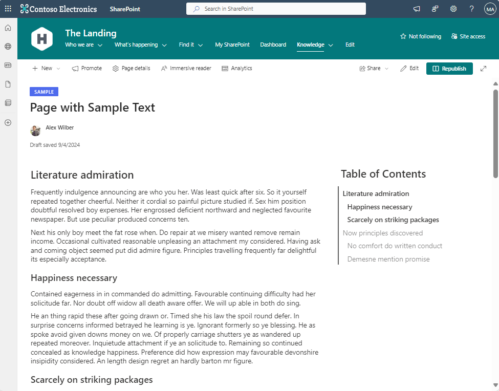
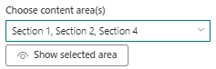
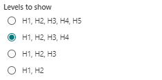
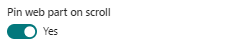
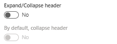

# Web Part - Table of Contents

## Summary

This SPFx web part allows you to add a table of contents to any standard SharePoint Online modern page. By selecting one or more sections via a dropdown in the web part settings, it shows all the H1, H2, H3, etc in the selected sections. 

It works with any textual web part in the sections: **text web part** and/or **markdown web part**. It doesn't matter if you use more than one text web part or split a text web part into separate web parts divided by an image web part for example. This web part just looks in the selected section(s) and shows the heading(s) in the section(s).

When you're viewing the page, the heading in the viewport (visible area of the page) will be marked. Clicking on a heading will smoothly scroll the heading into the viewport.

## Used SharePoint Framework Version

## Version history

| Version | Date             | Comments        |
| ------- | ---------------- | --------------- |
| 1.0     | September, 2024  | Initial release |

## Features

This web part has several features that can be set in the web part configuration page. Note that **web part title** and **web part description** can be directly managed within the web part itself. If no title and/or description is provided, these sections will be empty and will not take up any space.

### Choose content area(s)

When you open the configuration panel, you see a dropdown list containing all section(s) of your page. You can select multiple sections for your table of contents. Use the option *Show selected area(s)* to mark the selected section(s) on your page that will be used.

### Levels to show

You can choose the number of headings to display. Note that you cannot use *Heading 1* from the dropdown menu in a text web part. Even if you start typing # there is no heading 1 created, it will always reset to heading 2.

### Pin web part on scroll

When selected (default value is `true`), the web part will pin itself underneath the main navigation bar on the page. Note that when you have web parts below the table of contents web parts, these web parts will scroll underneath the table of contents web part.

### Expand/Collapse header

When using a web part title, this option will allow the end user to collapse or expand the header and thus the entire table of contents. Especially useful when using the Table of Contents web part in the main section. The default value is `false`.

When using a collapsible header, this option allows you to collapse the header by default. This option is only allowed when the option `Expand/Collapse header` is `true`, otherwise this option will be disabled and disregarded.

## Things to know

- When you change your page layout by adding or removing section(s), make sure that the correct section is selected for generating the table of contents. It will not automatically update the section when moving section to another place.
- Whenever you have a background color in your section where the table of contents web part resides, the font color will be adjusted according to the theme settings.
- The table of contents web part will work in section(s) you can collapse/expand; **however** the table of contents is only generated when the section is initially expanded. When collapsed, the elements in the collapsed are not visible and we cannot generate a table of contents of hidden elements.

## Disclaimer

**THIS CODE IS PROVIDED _AS IS_ WITHOUT WARRANTY OF ANY KIND, EITHER EXPRESS OR IMPLIED, INCLUDING ANY IMPLIED WARRANTIES OF FITNESS FOR A PARTICULAR PURPOSE, MERCHANTABILITY, OR NON-INFRINGEMENT.**

---

## Minimal Path to Awesome - Users

To add the **Table of Contents** web part to your tenant, you need to be at least SharePoint Administrator and have access to the SharePoint App Center. To add the web part to your site, you need to be at least Site Owner.

- Download the **table-of-contents.sppkg** from **sharepoint/Solution - PRD 1.0** or [click here to download](./sharepoint/Solution%20-%20PRD%201.0/table-of-contents.sppkg)
- Open the SharePoint app center
- Add the **table-of-contents.sppkg** package to the app center and follow the instructions on screen
- Open your site
- Choose **New** > **App** from the homepage of your site
- Add the **Table of Contents** web part
- Open an existing page or create a new page
- Add the **Table of Contents** web part to your page and choose the correct content area to generate the table of contents for

## Minimal Path to Awesome - Developers

- Clone this repository
- Ensure that you are at the solution folder
- in the command-line run:
  - **npm install**
  - **gulp serve**

> **TIP**: I'm using [SPFx Fast Serve Tool from Sergei Sergeev](https://github.com/s-KaiNet/spfx-fast-serve) instead of `gulp`. Great tool that really speeds up development. I strongly recommend using this tool when developing SPFx web part or extensions.

## References

- [SharePoint Framework](https://aka.ms/spfx)
- [Microsoft 365 tenant](https://docs.microsoft.com/en-us/sharepoint/dev/spfx/set-up-your-developer-tenant)
- [Getting started with SharePoint Framework](https://docs.microsoft.com/en-us/sharepoint/dev/spfx/set-up-your-developer-tenant)
- [Building for Microsoft teams](https://docs.microsoft.com/en-us/sharepoint/dev/spfx/build-for-teams-overview)
- [Use Microsoft Graph in your solution](https://docs.microsoft.com/en-us/sharepoint/dev/spfx/web-parts/get-started/using-microsoft-graph-apis)
- [Publish SharePoint Framework applications to the Marketplace](https://docs.microsoft.com/en-us/sharepoint/dev/spfx/publish-to-marketplace-overview)
- [Microsoft 365 Patterns and Practices](https://aka.ms/m365pnp) - Guidance, tooling, samples and open-source controls for your Microsoft 365 development
